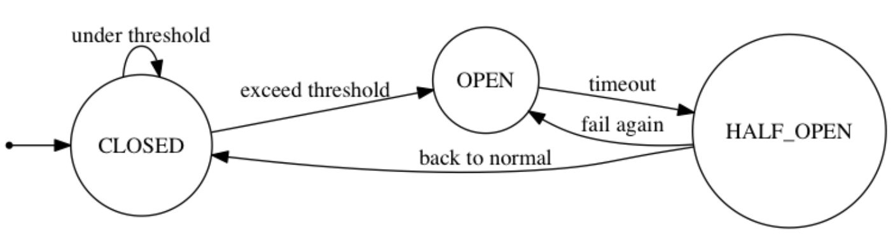

# 대규모 트래픽으로 인한 서버 과부화 해결 방법 #2

# 서킷 브레이커

웹이나 앱의 백엔드 서버 시스템은 API나 RPC로 연결된 네트워크로 구성되어 있다. 이 네트워크들 중 하나가 응답하지 않는 상황이 발생하게되면, 동작하지 않는 서비스 접속 시 타임아웃될 때까지 차단되어 해당 서비스와 의존성을 가진 서비스들까지 연쇄적으로 중단될 가능성이 있다.

네트워크 전체를 파악하고 있는 사람이 없는 경우 근본적인 원인을 알기까지 시간이 걸리게 되며, 이러한 연쇄 중단을 막기 위해 서킷 브레이커를 사용한다.

서킷 브레이커는 원격 접속의 성공/실패를 세어 에러율이 임계치를 넘었을 때 자동으로 접속을 차단 시키는 시스템이다. 서킷 브레이커는 세 가지의 상태값을 가진다.

[라인 엔지니어링 블로그](https://engineering.linecorp.com/ko/blog/circuit-breakers-for-distributed-services/)

### closed

closed 상태는 네트워크 요청의 실패율이 임계치보다 낮은 상태로 정상을 의미한다.

### open

open 상태는 임계치 이상의 상태로 요청을 전송하지 않고 바로 오류를 반환한다.(fail fast: 빠른 오류 발생으로 연쇄 중단을 막음)

### half_open

half_open 상태는 open 상태에서 일정 타임아웃으로 설정된 시간이 지나면 장애가 해결되었는지 확인하기 위해 half_open 상태로 전환된다. 다시 요청을 전송하여 장애가 풀린 경우 closed, 풀리지 않은 경우 open으로 변경된다.

# 컨텐츠 확인

## 불필요한 컨텐츠 제거

### 인프런 장애 복구 사례: 불필요한 쿼리 제거

-   `select *` 쿼리 사용으로 보여주지 않을 컬럼까지 조회 되지 않도록 불필요한 컬럼은 제외
-   인덱스를 추가하거나 쿼리를 변경해서 인덱스를 사용하도록 조회 쿼리 개선

## CDN을 통한 컨텐츠 제거

CDN(Content Delivery Network)은 서버와 사용자 사이의 물리적인 거리를 줄여 콘텐츠 로딩에 소요되는 시간을 최소화 해준다. 메인 서버를 사용하지 않고 CDN을 사용해 대용량 트래픽을 분산하여 지연없이 처리할 수 있다.

## 컨텐츠 캐싱

브라우저 캐시를 통해 해당 요청에 관한 항목을 캐시에서 응답을 읽어 네트워크 요청에 관련된 비용을 제거한다.

## 컨텐츠 압축

텍스트 기반 리소스는 압축해야 한다. gzip이나 Brotli를 통해 압축한다. 압축을 풀기 위해 사용될 cpu 자원까지 고려하여 압축한다.

## 컨텐츠의 우하한 저하(미리 준비된 응답)

시스템의 과도한 부하를 줄이기 위해 컨텐츠 및 기능을 일시적으로 줄이는 방법이다. 필수적이지 않은 기능을 비활성화 하고 검색 결과 수를 조절할 수 있다.
