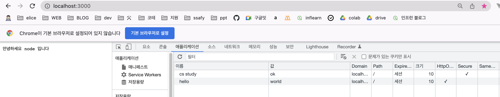
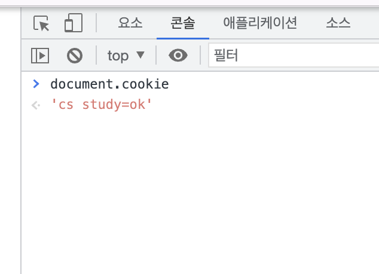

# 웹브라우저의 캐시 #2. 제대로 배우는 쿠키

# Cookie

클라이언트에서 데이터를 저장하는 방법 중 하나이다. 쿠키는 요청 시 서버에 자동으로 전송된다. 클라이언트와 서버 둘 다 접근 가능하지만, 서버에서 만료 기한 확인 등 쿠키에 대한 조작을 한다.

## session cookie

expires나 max-age 같은 속성을 지정하지 않은 쿠키를 말한다. 브라우저가 닫힐 때 소멸되는 특징이 있다.

## 영구 쿠키

expires나 max-age 속성을 지정한 쿠키로, 브라우저를 닫았을 때 만료되지 않지만 지정한 기간이 지나게 되면 소멸된다.

## 쿠키의 속성

-   기본적으로 쿠키는 key-value형태로 저장이 된다
-   expires, max-age, domain, path 등의 속성을 추가로 지정할 수 있다
-   secure 속성은 크롬 52 이상 firefox 52 이상을 포함한 일부 브라우저는 secure 속성을 무시한다
-   httponly 속성은 공격자가 브라우저에서 자바스크립트로 접근할 수 없게 만든다. DOM을 사용하지 못하도록 한다 (ex. docuement.cookie)
-   domain과 path는 cookie의 scope를 정의한다.
-   SameSite=strict 설정은 동일한 도메인에서 시작된 경우만 쿠키가 애플리케이션으로 전송되도록 허용한다

```jsx
const http = require("http");

const host = "localhost";
const port = 3000;

const server = http.createServer((req, res) => {
    res.setHeader("Content-Type", "text/plain; charset=utf-8");
    res.setHeader("Set-Cookie", ["hello=world; httponly", "cs study=ok; Secure"]);
    res.end("안녕하세요 node 입니다");
});

server.listen(port, host, () => {
    console.log(`server is running at port number : ${port}`);
});
```



node js 서버를 사용해 쿠키를 설정해보았다. httponly 속성을 준 쿠키와 Secure 속성을 준 쿠키 두 개를 저장한다.

쿠키 속성에 HttpOnly와 Secure에 체크가 된 것을 확인할 수 있다.



크롬의 콘솔창에서 DOM으로 브라우저의 쿠키에 접근해 보았을 때 httponly 속성을 주지 않은 쿠키만 볼 수 있다. 리액트나 뷰와 같은 프레임워크를 사용하는 경우 DOM을 사용하지 못하지만 개발 시에도 알아두면 도움될 것 같다.

# Session ID 설정

쿠키에 session id를 담을 때 클라이언트의 인증 정보를 알 수 없게 해야 한다. session id는 랜덤하게 생성되는 알고리즘과 충분한 서비스 사용자 수를 수용할 수 있는 만큼 지정해야 한다. 또한 앞서 설명한 httponly와 세션 timeout을 지정해야 한다.
